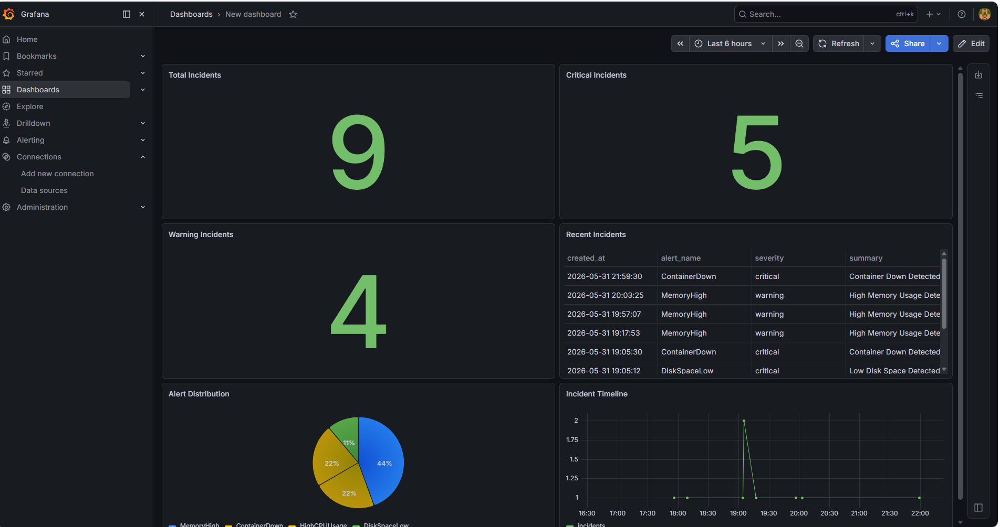
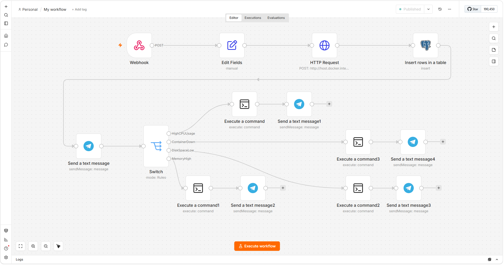
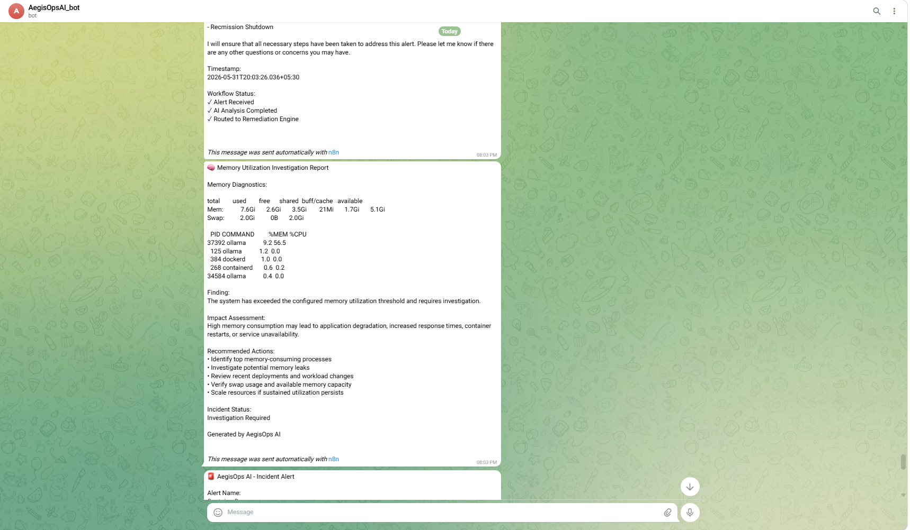
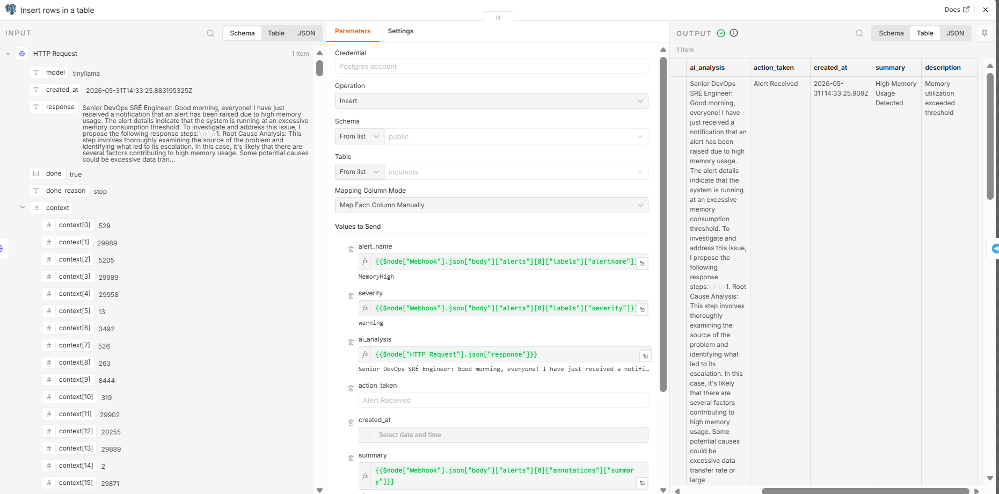

# AegisOps AI

## AI-Powered Infrastructure Monitoring and Incident Response Platform

## Overview

AegisOps AI is an infrastructure monitoring and incident response platform designed to automate the detection, analysis, investigation, and tracking of operational incidents.

Traditional monitoring systems can identify infrastructure issues such as high CPU utilization, memory pressure, storage exhaustion, or service failures. However, engineers are still required to manually investigate alerts, collect diagnostics, determine root causes, and identify remediation actions.

AegisOps AI addresses this challenge by integrating monitoring, alerting, workflow automation, artificial intelligence, incident storage, and dashboard visualization into a unified platform.

The system continuously monitors infrastructure resources, generates alerts when thresholds are exceeded, performs AI-assisted incident analysis, executes diagnostic procedures, stores incident records, and provides operational visibility through dashboards and notifications.

---

# Problem Statement

Infrastructure teams often spend significant time performing repetitive operational tasks after an alert is generated.

A typical incident response process includes:

1. Receiving an alert.
2. Determining the affected resource.
3. Collecting diagnostic information.
4. Identifying the root cause.
5. Investigating system health.
6. Documenting the incident.
7. Tracking resolution activities.

These activities increase operational overhead and delay incident resolution.

The objective of AegisOps AI is to automate these activities and reduce manual intervention during the incident response lifecycle.

---

# System Architecture


### Monitoring Layer

Prometheus continuously collects infrastructure metrics from Node Exporter.

Metrics include:

* CPU Utilization
* Memory Utilization
* Disk Utilization
* System Health Metrics

### Alerting Layer

Prometheus evaluates alert rules and forwards active alerts to Alertmanager.

Alertmanager is responsible for:

* Alert routing
* Alert grouping
* Webhook integration
* Incident forwarding

### Automation Layer

n8n serves as the orchestration engine of the platform.

It processes incoming alerts and coordinates the following activities:

* Alert processing
* AI analysis
* Database storage
* Notification delivery
* Diagnostic execution

### AI Analysis Layer

Ollama and TinyLlama are used to generate contextual analysis for incoming incidents.

The model receives:

* Alert Name
* Severity
* Summary
* Description

The generated output includes:

* Root Cause Analysis
* Impact Assessment
* Troubleshooting Guidance
* Remediation Recommendations

### Incident Storage Layer

PostgreSQL stores all incident information.

This enables:

* Historical incident tracking
* Dashboard reporting
* Trend analysis
* Auditability

### Visualization Layer

Grafana provides visibility into incident activity and operational metrics.

---

# Key Features

## Infrastructure Monitoring

The platform continuously monitors system resources and evaluates predefined alert conditions.

Implemented monitoring capabilities include:

* CPU Monitoring
* Memory Monitoring
* Disk Monitoring
* Container Health Monitoring

---

## Automated Alert Processing

Alerts generated by Prometheus are automatically forwarded to n8n through Alertmanager webhooks.

This removes the need for manual alert handling.

---

## AI-Assisted Incident Analysis

Every incident is analyzed using a locally hosted Large Language Model.

The generated analysis helps operators quickly understand:

* What happened
* Possible causes
* Expected impact
* Recommended actions

---

## Automated Diagnostics

The platform automatically executes investigation commands based on the alert type.

### High CPU Usage

Purpose:

Identify CPU-intensive processes.

Diagnostic Command:

```bash
ps -eo pid,comm,%cpu,%mem --sort=-%cpu | head -6
```

---

### High Memory Usage

Purpose:

Identify memory pressure and memory-intensive processes.

Diagnostic Commands:

```bash
free -h

ps -eo pid,comm,%mem,%cpu --sort=-%mem | head -6
```

---

### Low Disk Space

Purpose:

Identify storage bottlenecks and large files.

Diagnostic Commands:

```bash
df -h /

du -sh /var/log/* 2>/dev/null | sort -hr | head
```

---

### Container Failure

Purpose:

Verify container availability and recovery status.

Diagnostic Command:

```bash
docker compose up -d && docker ps
```

---

## Incident Management

All incidents are stored in PostgreSQL for future analysis.

Stored information includes:

* Alert Name
* Severity
* Summary
* Description
* AI Analysis
* Action Taken
* Timestamp

---

# Alert Rules

The following alert rules are currently implemented.

| Alert         | Purpose                          | Severity |
| ------------- | -------------------------------- | -------- |
| HighCPUUsage  | Detect excessive CPU utilization | Critical |
| MemoryHigh    | Detect memory pressure           | Warning  |
| DiskSpaceLow  | Detect storage exhaustion        | Critical |
| ContainerDown | Detect service unavailability    | Critical |

---

# Technology Stack

| Layer                   | Technology             |
| ----------------------- | ---------------------- |
| Monitoring              | Prometheus             |
| Metrics Collection      | Node Exporter          |
| Alerting                | Alertmanager           |
| Workflow Automation     | n8n                    |
| Artificial Intelligence | Ollama, TinyLlama      |
| Database                | PostgreSQL             |
| Visualization           | Grafana                |
| Notifications           | Telegram Bot API       |
| Containerization        | Docker, Docker Compose |
| Operating System        | Linux (Ubuntu/WSL2)    |

---

# Database Design

The platform currently uses a PostgreSQL database named `aegisops`.

Primary incident table:

```sql
CREATE TABLE incidents (
    id SERIAL PRIMARY KEY,
    alert_name VARCHAR(100),
    severity VARCHAR(50),
    summary TEXT,
    description TEXT,
    ai_analysis TEXT,
    action_taken TEXT,
    created_at TIMESTAMP DEFAULT CURRENT_TIMESTAMP
);
```

---

# Dashboard Capabilities

Grafana dashboards provide visibility into:

* Total Incidents
* Critical Incidents
* Warning Incidents
* Alert Distribution
* Incident Timeline
* Recent Incident Activity

These dashboards enable operators to identify recurring issues and track incident trends over time.

---

# Project Structure

```text
AegisOps-AI/
│
├── docker/
│   ├── alertmanager/
│   │   └── alertmanager.yml
│   │
│   ├── prometheus/
│   │   ├── prometheus.yml
│   │   └── alerts.yml
│   │
│   └── postgres/
│       └── init.sql
│
├── workflows/
│   └── AegisOps_AI.json
│
├── docs/
│
├── screenshots/
│
├── docker-compose.yml
│
├── .env.example
│
├── README.md
│
└── .gitignore
```

---

# Screenshots

## Grafana Dashboard



## n8n Workflow



## Telegram Notification



## Incident Database Records



---

# Future Enhancements

Planned improvements include:

* Incident Lifecycle Management
* Incident Categorization
* Remediation Tracking
* Automated Recovery Workflows
* AWS Deployment
* Advanced AI Models
* SLA and MTTR Analytics
* Multi-Node Monitoring

---

# Learning Outcomes

This project provided practical experience in:

* Infrastructure Monitoring
* Observability Engineering
* Alert Management
* Workflow Automation
* Incident Response
* AI Integration
* PostgreSQL Database Design
* Dashboard Development
* Docker-Based Deployments
* Linux System Administration

---

# Author

Harshitha Galla

Aspiring DevOps Engineer

GitHub: https://github.com/Harshitha-Galla5
